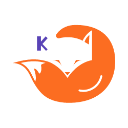

# Kurama - Mining and Analyzing GitLab Projects



## Overview

**Kurama** is a powerful tool part of the DxWorks organization, designed to extract and analyze data from projects hosted on GitLab repositories. With seamless integration and easy setup, Kurama helps you mine valuable data and view elaborate metrics with minimal effort.

## Table of Contents

- [Getting Started](#getting-started)
  - [Prerequisites](#prerequisites)
  - [Installation](#installation)
  - [Configuration](#configuration)
  - [Running the Application](#running-the-application)
- [Features](#features)
- [Results](#results)
- [Contact](#contact)

## Description

This application is designed in order to help data scientist, researchers and managers to analyze data coming from projects hosted on GitLab repositories and export different results. Data is extracted efficiently using the GitLab GraphQL API and various statistics regarding general project information, merge requests, issues, members and team collaboration are available.

## Getting Started

Follow these instructions to get a copy of the project up and running on your local machine.

### Prerequisites

Ensure you have the following installed on your system:

- [Node.js](https://nodejs.org/en/download/package-manager) 
- [npm](https://docs.npmjs.com/downloading-and-installing-node-js-and-npm)

### Installation

1. **Clone the repository**:
    ```sh
    git clone https://github.com/your-username/gitlab-miner.git
    cd gitlab-miner
    ```

2. **Install dependencies**:
    ```sh
    npm install
    ```

### Configuration

Before starting the application it is necessary to complete data inside the configuration file named "config.yml".

Introduce the path to the repository where your project is hosted, at least one token with permissions to access the project and 2 values for the parameters that filter the collaboration graph. In case you do not coose this feature, add 0 values.

A full example can be seen below: 

```yaml
gitlabApiUrl: 'https://gitlab.com/api/graphql'

projectFullPath: 'mygitlabteam3/MyProject'

tokens:
  - 'YOUR_GITLAB_ACCESS_TOKEN_1'
  - 'YOUR_GITLAB_ACCESS_TOKEN_1'

minLinkValue : 100
minMemberLinks : 6
```

### Running the Application

To start the application, simply run:

```sh
npm start
```

## Features

- TypeScript Support: Written in TypeScript for better code quality and maintenance.
- Easy Configuration: Minimal setup required to get started using Node.js and npm.
- Data Extraction: Efficiently extract comprehensive data from your GitLab repositories.
- Structured Data: GraphQL queries in order to structure and customize data extraction.
- Powerful analysis: Various and complex metrics regarding the projects, the members and the team collaboration and interactions. 
- Modular Architecture: Easy to extend and maintain.

## Results

Inside the main folder of the application the allData.json file can be found and insides the "results" directory all the resulted metrics are available. This directory also hosts another directory containing the metrics about the members, named "members".

- allData.json file containing absolutely all the data extracted
- ProjectInfo.json containing general metrics regarding the project
- MembersModel.json containg metrics related to each and every member
- TeamGraph.json containing the team collaboration and interactions graph
- visualizations in numeorus JSON files for all of the above 

## Contact

Author: Adrian Pop

Email: 04.pop.adrian@gmail.com / adrian.pop2@student.upt.ro

GitHub / GitLab: adrianpop3
